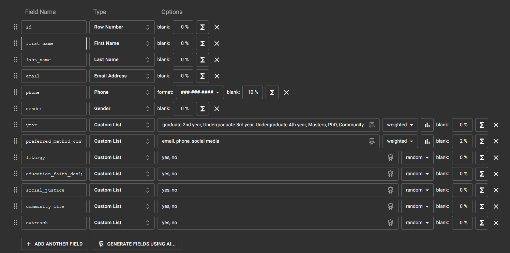
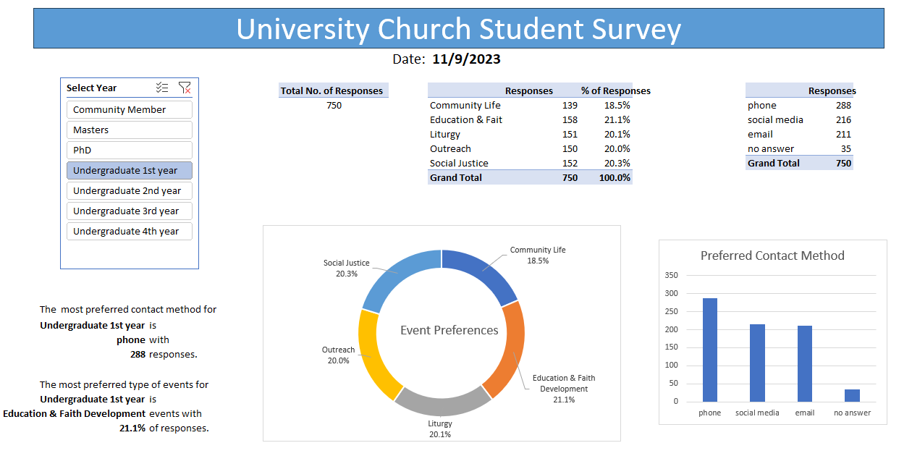

# Community Survey for Church Events

*Photo courtesy of Matheus Bertelli via [Pexels](https://www.pexels.com/photo/group-of-people-standing-inside-room-2608517/).*

## Intro

This project was based on one of the annual projects I executed as a church secretary near my local university. Every year, we asked new and current community members what kinds of events and groups they would like to see and join at our church. Here are the five main categories:

- Liturgy (Sunday and daily services, prayer services, choir practice, etc.)
- Education and Faith Development (weekly Bible studies, guest speakers, etc.)
- Community Life (weekly dinners, socials, study halls, etc.)
- Outreach (social media, publicity, campus activities, interfaith events)
- Social Justice (charity fundraisers, volunteer events, mission trips, etc.)

In this survey, we also asked people what methods of contact they prefer for news and announcements (email, social media, phone).

## Data Sources

The mock dataset for survey results was randomly generated using [Mockaroo](https://mockaroo.com/).

Here is the table schema: 

## Tech Stack

Microsoft Excel (PowerQuery, PivotTables, PivotCharts)

## Data Cleaning

### Power Query

- Used "Pivot Column" function to replace nulls in preferred_method_contact column with "no answer"
- Selected event category columns ('liturgy', 'education_faith_devlp', 'social_justice', 'community_life', 'outreach') and used "Unpivot Only Selected Columns"
- Renamed new columns to "category" and "votes"
- Wrote additional queries to build separate tables for event category votes ("EventCategory") and contact method preferences ("ContactMethod")

### PivotTables & Data Model

- Uploaded cleaned survey data table and tables for data subsets into the Data Model. Built relationships so all tables would connect by "year" (this would later be the variable for the slicer)
- Used a formula to [call the value from a PivotTable slicer into a cell](https://techcommunity.microsoft.com/t5/excel/how-to-capture-the-selected-value-of-a-slicer-in-a-formula/m-p/3649281)

## Dashboard (Excel)

## Key Insights and Recommendations

### Results
- Education & Faith Development was the most requested category, with three of the seven groups voting for it as their top preference (1st year undergraduates with 21%, 4th year undergraduates with 22%, and PhD students with 24%).
- The 1st year undergraduates also had the largest amount of overall responses (750 responses).
- The 1st year undergraduates had a big surprise for contact method preferences. Phone was the most preferred method (288 responses). This does not line up with the societal expectation that younger generations such as Gen Z preferring online methods of communication. All other undergraduate years preferred email (2nd and 4th years) or social media (3rd year). 

### Recommendations
- Allocate slightly more funding for Education & Faith Development events (ie. Bible studies, guest speakers) for the year.
- Maintain all three methods of communication equally for news and event announcements.

### Lessons Learned
- Customize mock data more to reflect real patterns observed from the original data I've worked with at my old job. I especially need to adjust weights properly to certain groups. 
- It may be more useful to have a set of charts and tables for OVERALL results in addition to the filtered data. I currently don't have an idea for how to show that without making the dashboard too clustered. (I guess I could create another worksheet?)

It's not the most perfect or prettiest Excel dashboard, but this was the most time I've spent working with PivotTables and the Data Model. It was quite the learning process! I think I'm more comfortable with PivotTables now. 
